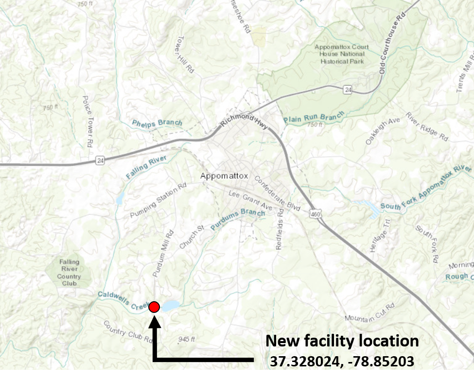

# DEQ R Activity: Site-Specific Streamflow Analysis

In this activity, we want to calculate relevant stream flows for an imaginary facility on Caldwell's Creek near Appomattox, Virginia. We can do this by pulling streamflow data from nearby USGS gages using the **dataRetrieval** R package and running some basic **tidyverse** summary functions. We will read in facility discharge data to adjust our statistics to be reflective of the streamflow by itself. By joining site-specific data to our USGS gage data, we can also scale our flow values to be more representative of our facility on Caldwell's Creek.

## Step 1: Look at Site and Nearby Streamgages

{height="300"}

Let's imagine that a [small facility](https://www.google.com/maps/place/37%C2%B019'40.9%22N+78%C2%B051'07.3%22W/@37.3238666,-78.8749752,13.21z/data=!4m5!3m4!1s0x0:0x995ab048038a848!8m2!3d37.328024!4d-78.85203) needs their VPDES permit renewed for their 2.5 MGD discharge to Caldwell's Creek. Due to the particular work done at this (imaginary) facility, we are primarily concerned with the discharge of Benzene to the creek. For a stream like Caldwell's Creek, we would need to apply the human-health water quality criteria of 160 ug/L when determining any discharge limits needed at the facility. Caldwell's Creek is a tributary to Falling River, which eventually confluences with the main stem of the Roanoke River near Brookneal.

However, before we can draft our permit limits and conduct a reasonable potential analysis, we need to figure out what the streamflow at Caldwell's Creek is. More specifically, we need to know what the *Harmonic Mean* flow of the stream is UPSTREAM of the facility. So how can we calculate this?

We know there are two USGS gages downstream of our facility that have collected data for the past 80+ years. If we wanted to, we could search for additional nearby gages using the [DEQ DFLOW](https://rconnect.deq.virginia.gov/CombinedPWTool/) program.

| Gage ID  |           Gage Name            | Start Date | End Date |
|:--------:|:------------------------------:|:----------:|:--------:|
| 02062500 | Roanoke River at Brookneal, VA | 10/01/1923 | Present  |
| 02064000 | Falling River Near Naruna, VA  | 10/01/1929 | Present  |

Our first instinct is to use the gage on the Roanoke River. It has plenty of data to work with and it has been used for a number of permits in and around this area.

## Step 2: Download and Investigate Gage Data

Now that we know what gage we want to look at, we need to pull in some data. This gage has collected daily flow for the past 100 years. It would be annoying to pull this data off of the USGS NWIS website, but luckily we don't have to! We can use dataRetrieval instead! We will want to pull daily (USGS code "dv") mean streamflow data (USGS parameter code "00060" and stat code "00003").

We can get our flow data using the **dataRetrieval** function readNWISdv(). This function reads daily value (dv) for a given parameter and stat code. We will use 00060 as the parameter code to make sure we get flow data and 00003 as the stat code to get mean flow. You can explore more [parameter](https://help.waterdata.usgs.gov/parameter_cd?group_cd=%) and [stat codes](https://help.waterdata.usgs.gov/code/stat_cd_nm_query?stat_nm_cd=%25&fmt=html) here. Check out the help file for readNWISdv() to figure out how to pull our data! The parameter codes are also in our R files for dataRetrieval. See the hidden parameterCdFile data table!

```{r chunk1}
#Be sure to call the dataRetrieval library!
library(dataRetrieval)

#We will use the dataRetrieval function readNWISdv to get mean daily streamflow
#at our gage
gageData_all <- readNWISdv()

#Set the column names of the data frame to the following: "agency", "site_no",
#"Date", "Flow", "QC"
names(gageData_all) <- 


#Let's see what we got
View(gageData_all)

```

You should get a data frame that has \~36,100 observations of 5 variables. That's a lot of data! We will want to make sure this data is safe to use. First, we will perform a very basic QC of the data. We want to make sure the mean annual flow of the River has not changed significantly. Changes to the river flow could be a result of upstream development, hydraulic structures, or river diversions and could skew the harmonic mean flow we need for our permit.

So, let's use the **tidyverse** package to summarize our data. We will need to do a bit of data processing, so let's tackle this one step-at-a-time. First, the USGS generally classifies their streamflow data as "Approved" or "Provisional". Data collected during the past 3 months will likely be labeled provisional as USGS staff QC's the streamflow records. Data during large storms may also be marked as provisional if water levels exceed the gage calibration until USGS staff have a chance to extrapolate a proper value. For our analysis, we only want to use the "Approved" data that has gone through the USGS QC protocols. It's easy for us to filter for the data we need using the last column of the data frame! We should remove all provisional data, labeled as "p".

```{r chunk2}
#Be sure to call in the tidyverse pacakges!
library(tidyverse)

#Filter for instances where QC is not "P" (Provisional)
gageData_QC <- gageData_all %>%

```

Good. Now, we need to work with the dates. This can sometimes be the toughest part of formatting data. Dates are very easy for us to recognize, but can be tricky for computers. We want to make new columns for gageData_QC that contain the year the streamflow was taken. To do that, we need to work with the "Date" column.

```{r chunk3}
#First, let's make sure R knows we are working with dates using as.Date on the
#Date column:
gageData_QC <- gageData_QC %>% 

#Now, lets make good use of our dates. Lets get the year from the date column.
#We can use the year() function from lubridate!
library(lubridate)
gageData_QC <- gageData_QC %>% 

#We should now see that we have data for 1923 - 2022:
unique(gageData_QC$Year)

```

Excellent. Now we can calculate the mean annual flow using group_by() and summarize(). Create a data frame that contains the mean flow and minimum daily flow for each year on record. Then, plot BOTH minimum and mean flow with year on the x-axis and flow on the y-axis!

```{r chunk4}
#Remember, group_by and summarize always go together!
gageData_summary <- gageData_QC %>% 
  
#Plot the data
ggplot(gageData_summary) +
  geom_point(col="blue") + 
  geom_point(col="red") + 
  theme_classic()
```

Looking at the plot, we can quickly see that something has changed the flow at this gage. Starting right around 1963, we see a 10-year period where flow has decreased. From there out, flow variability seems to have decreased slightly. If you are familiar with this portion of the Roanoke River, you have probably already guessed what happened. The Smith Mountain Lake Dam was finished in 1963! This had a tremendous impact on the flow of Roanoke River. If we want to use a lot of data to estimate harmonic mean, this gage will not be appropriate for our analysis.

Instead, we will use gage 02064000. I won't make you repeat everything we just did, but if you were to create a graph showing mean and minimum annual flow for this new gage on Falling River, you'd see it is more stable throughout its record and thus more suitable for flow analysis. So, let's download data for our new gage and filter out the provisional data.

```{r chunk5}
#We will use the dataRetrieval function readNWISdv to get mean daily streamflow
#at our gage
gageData_all <- readNWISdv("02064000",parameterCd = "00060")
#We will set some names for the data frame to make it easier to work with
names(gageData_all) <- c("agency","site_no","Date","Flow","QC")
#Filter for instances where QC is not "P" (Provisional)
gageData_QC <- gageData_all %>% 
  filter(QC != "P")
```

## Step 3: Calculate the Harmonic Mean

So, we have downloaded our gage data and we are happy with it. Time to determine our harmonic mean flow. The harmonic mean is usually computed as: $$HM=\frac{1}{\Sigma \frac{1}{Q}}$$ Where Q is the streamflow. However, for this calculation to work, streamflow cannot be missing or zero. To adjust for any days of zero flow, we can do the following calculation: $$HM_u=\Sigma \frac{1}{Q}$$ $$HM=\frac{(N_d-n_z)}{HM_u} * \frac{N_d-n_z}{N_d}$$ Where $N_d$ is the number of days in the study period and $n_z$ is the number of days of zero flow.

So, let's start off by first creating a data frame that has all the non-zero flow values in it and calculating $N_d$ and $n_z$ (perhaps using the length() or dim() functions)

```{r chunk6}
#Let's filter our gageData_QC to only include positive flow values
gageData_noZeros <- gageData_QC %>% 
  
#We can use length to determine how many flow entries there are in our complete dataset
N_d <- length()

#We can then calculate the difference between N_d and gageData_noZeroes
n_z <- 

```

You should see that at this gage, all flow values are above zero! This makes the harmonic mean calculation easy!

```{r chunk7}
#Let's calculate the harmonic mean flow using the formula above:
HM_u <- 
HM <- 
```

The harmonic mean flow is about 67.5 cfs at this gage!

## Step 4: Adjust Streamflow to Our Facility Based on Site-Specific Data

The harmonic mean we have calculated is based on the gage data downstream at the USGS gage on Falling River. This is a good representation of the flow at the gage, but doesn't mean much for our stream which is nearly 15 miles upstream. So, we need to adjust our value to be more representative of the conditions at our facility, upstream of the discharge.

Luckily, the kind folks at our facility have collected streamflow data on-and-off for the past 20 years (the data represents flow downstream of their outfall). They have provided us these flow values (in MGD) in a csv file. They have also provided the facility discharge during these days in a separate csv file.

We want to know what the harmonic mean streamflow is upstream of the facility discharge. We can do this by creating a regression of the USGS gage streamflow and upstream flow at our facility. This will take a few steps.

### Step 4A: Read-In Facility Discharge and Streamflow Data

First, let's read in the streamflow and discharge data provided by the facility. The data are both provided in csv files.

```{r chunk8}
#We need to read in the csv files for both the stream flow and the discharge (dis) data
facilityFlow <- read_csv("data/facilityFlowinMGD.csv")
facilityDis <- read_csv("data/facilityDischargeinMGD.csv")
```

Notice that the discharge information has been provided in a wide format. We will need to adjust this to a long format. We can filter for just the streamflow (we don't need the pH or hardness data). It would be helpful to make sure flow values are in a column labeled "FlowMGD", perhaps using select().

```{r chunk9}
#We can use tidyverse functions to pivot the table into a long-form dataset,
#then filter to only have flow values. Finally, we can use select to rename and
#select columns:
facilityDis_long <- facilityDis %>%   
  
  
```

We will also need to make sure the date columns are reading as dates in R!

You will see that this is tricky for the facility discharge, where the operator entered the dates using abbreviations. How can we fix this? as.Date()! Check out the format section under the help menu. You will need to enter a custom format using strptime. See the help menu for strptime or this [link](https://www.stat.berkeley.edu/~s133/dates.html). There are a few hints below if you find yourself stuck. Dates are tricky!

```{r chunk10}
#We need to make sure R knows there are dates here
facilityFlow$Date <- as.Date(facilityFlow$Date)
#For the discharge data, the dates are in the format 01-Jan-21 to represent
#January 1, 2021. We need to make sure R looks for this custom format using the
#strptime helpers
facilityDis_long$Date <- 
```

*Hint 1:* The standard R date format is %Y-%m-%d, representing a date in the format YYYY-mm-dd such as 2000-01-31. Here, we can use %d to represent the day, but we need to find the correct code for the abbreviated month and the two-digit year. See strptime() for more details or see this [link](https://www.stat.berkeley.edu/~s133/dates.html)

*Hint 2:* you will need %d to represent the days, %b to represent the abbreviated month, and %y to represent the two-digit year

### Step 4B: Determine the Harmonic Mean Flow at Falling Creek

So, now we have the flow downstream of our facility and the discharge from the facility. First, we need the flow upstream of the discharge (so the streamflow that excludes the discharge flow!). And we will need to convert that flow into CFS (1 MGD = 1.547229 CFS)! You may notice for this example there is a lot of facility flow data and it contains a number of high flow values. In general, you should only compare low flow data when trying to scale critical flow values. However, in this example, we use a bigger dataset for the purposes of illustration.

```{r chunk11}
#Lets create a data frame to store our flow upstream of our facility. It will
#have all of the dates in facilityFlow
upstreamFlow <- facilityFlow
#Subtract the discharge from the facility from the flow downstream of our facility 
upstreamFlow$FlowMGD <- 
#Convert to cfs!
upstreamFlow <-  
```

Excellent! Now we have the flow data upstream of our facility. To adjust the harmonic mean, we can compare the flow upstream of our facility to the flow at the USGS gage. We can then find a statistical relationship and use it to scale the harmonic mean to our site! To start, we need to get all of our data in one place. We want to create a data frame that has the date, the flow upstream our facility, and the USGS flow that occurred on the same date. We only want records in both tables. This will need some kind of join(). Only keep the date and the flows.

Rename the upstream flow (in cfs) to be "UpstreamFlow" and the gage flow to be "GageFlow"

```{r chunk12}
#We will need to join in gageData_QC. We only want to keep dates that are in
#both the gage data and our facility data. Plus we will want to rename the
#columns to something more meaningful
flowComparison <- upstreamFlow %>% 
  
```

Now, let's plot our data. Plot UpstreamFlow on the y-axis and GageFlow on the x-axis

```{r chunk13}
#Plot the data
p <- ggplot(data = flowComparison) +
  geom_point(aes()) + 
  xlab("Flow at Falling River Gage (cfs)") + ylab("Flow at Caldwell's Creek (cfs)") + 
  theme_classic() +
  theme(panel.grid.major = element_line(color = "grey",linetype = 3))

p
```

Looks good! We will now use a non-linear regression to relate the gage flow to the flow upstream our facility. This is a little advanced, so the code has been written for you. Below, we use the nls() function to estimate a power relationship where UpstreamFlow is a function of GageFlow in the following formula (where nls() will find values for coefficieints A and B): $$UpstreamFlow = A * GageFlow^B$$ We then turn the regression into a **function**. Again, this is pretty advanced. But, notice that at the end, we can call regFun() to convert a GageFlow into an estimated UpstreamFlow value!

```{r chunk14}
#We can use nls to determine a relationship between GageFlow and UpstreamFlow.
#We will need to provide it a formula and we choose a power formula as above.
#nls() will iteratively try to fit values to A and B until it determines the
#best fit. We will need to provide starting values for it to try out and we
#arbitrarily assign 1
NLR <- nls(data = flowComparison,
           formula = UpstreamFlow ~ A * GageFlow ^ B,
           start = c(A = 1,B = 1))
#Using summary(), we can learn more about our regression
summary(NLR)

#We create a function out of our regression called regFun. If we provide
#regFun() with a flow at the USGS gage on Falling River, it will output the
#streamflow upstream of our gage based on the non-linear regression NLR above.
#We will need to provide NLR when running regFun()
regFun <- function(GageFlow,NLR){
  coeffA <- coef(NLR)[[1]]
  coeffB <- coef(NLR)[[2]]

  Qupstream <- coeffA * GageFlow ^ coeffB
  return(Qupstream)
}

#Test regFun for yourself:
regFun(300,NLR)
```

We built a custom function, regFun, that uses a non-linear regression to predict flow upstream of our facility. Let's include it on our plot and finally use it to calculate the Harmonic Mean upstream of our facility. We could then use this to calculate a wasteload allocation and the applicable Benzene limit for our facility!

```{r chunk15}
p + stat_function(fun = ,
                  args = list(NLR=NLR),
                  col="navy")

#So, the harmonic mean upstream our facility is:
regFun()
```

Our harmonic mean is about 24.3 cfs!

------------------------------------------------------------------------

## Challenges!

A few challenges for anyone who wants more flow analysis: 1. Create a function to calculate harmonic mean so we can use it more easily in the future

```{r chunk16}
#This function takes in a data frame with a "Flow" column and outputs harmonic mean:
HMfun <- function(gageData){
  #Let's use filter our gageData_QC to only include positive flow values
  
  #Output the harmonic mean from the function (or in other words, return it from
  #the self-contained function environment). Change the variable below to what
  #your output is!
  return(YourOutputVariableGoesHere)
}
```

2.  What is the harmonic mean flow of the *Roanoke River* gage looking at all available data? Does the value before and after the closure of Smith Mountain Lake (i.e. 1923 - 1960 and 1970 - Present)? By how much?

```{r chunk17}
#We can use the function from Challenge 1 above to quickly assess this. We will
#first use the dataRetrieval function readNWISdv to get mean daily streamflow at
#our gage
gageData_RR <- readNWISdv("02062500",parameterCd = "00060")

#We will set some names for the data frame to make it easier to work with
names(gageData_RR) <- c("agency","site_no","Date","Flow","QC")

#Filter for instances where QC is not "P" (Provisional)
gageData_RRQC <- gageData_RR %>% 
  

#We will use filter to create datasets before and after dam closure:
gageData_beforeDam <- gageData_RRQC %>% 
  
gageData_afterDam <- gageData_RRQC %>% 
  

#The harmonic mean of the Roanoke River with all data is 1272 cfs
HMfun()
#The harmonic mean of the Roanoke River before dam closure is 1369 cfs
HMfun()
#The harmonic mean of the Roanoke River after dam closure is 1330 cfs
HMfun()

#The harmonic mean of the stream is relatively similar before and after the dam
#closure. However, the low flows caused by the dam filling lower the harmonic
#mean by nearly 100 cfs when using the entire gage dataset!
```

3.  What would be the estimated harmonic mean upstream of our facility if we compared our upstreamFlow data to the *Roanoke River* gage? Does the regression fit the data better if we only look at lower flow values (where the flow at Caldwell's Creek is below average?)

```{r chunk18}
#We will need to join in gageData_RRQC. We only want to keep dates that are in
#both the gage data and our facility data. Plus we will want to rename the
#columns to something more meaningful
flowComparison_RR <- upstreamFlow %>% 


#We can use nls to determine a relationship between GageFlow and UpstreamFlow.
#We will need to provide it a formula and we choose a power formula as above.
#nls() will iteratively try to fit values to A and B until it determines the
#best fit. We will need to provide starting values for it to try out and we
#arbitrarily assign 1
NLR_RR <- nls(data = flowComparison_RR,
              formula = UpstreamFlow ~ A * GageFlow ^ B,
              start = c(A = 1,B = 1))

#So, the harmonic mean upstream our facility is now predicted to be 33.89 cfs.
#This is why picking the right gage is important!
HM_RR <- 
regFun()

#Plot the data. We can see some of the high flows at the Roanoke River Gage may
#be skewing our regression. We would probably get better results if we only used
#low flows within flowComparison
ggplot(data=flowComparison_RR) +
  geom_point() + 
  stat_function() +
  xlab("Flow at Roanoke River Gage (cfs)") + ylab("Flow at Caldwell's Creek (cfs)") + 
  theme_classic() +
  theme(panel.grid.major = element_line(color = "grey",linetype = 3))

#Let's find out. Let's only use data in flowComparison_RR where the flow at
#Caldwell's Creek is below average
meanCaldwellsFlow <- 

#Filter the data to be below the mean flow
flowComparison_RRlowFlows <- flowComparison_RR %>% 
  
#run another regression
NLR_RRlowFlow <- nls()

#Now our predicted flow is skewed low! Its about 13.4 cfs! This is why we must be
#careful when choosing a gage!
HM_RRlowFlow <- HMfun()
regFun()

#Plot the data. The fit may appear better, but it still misses a lot of data!
ggplot(data=flowComparison_RRlowFlows) +
  

```
